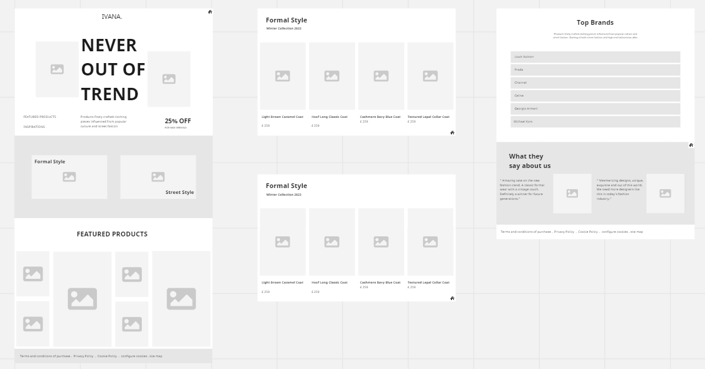
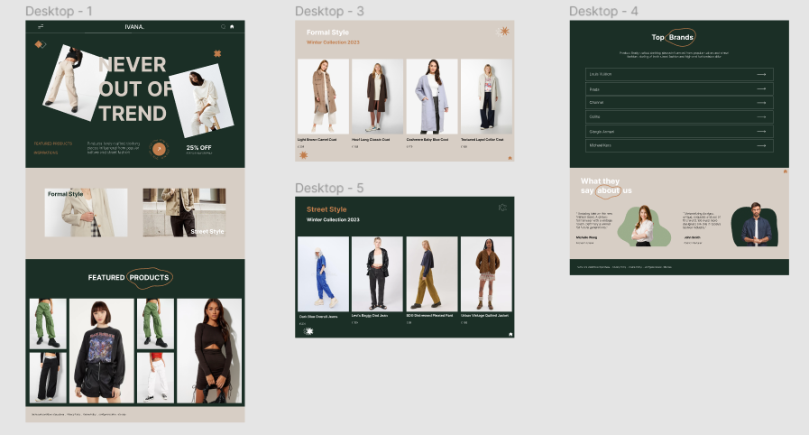

# UI UX

A clothing line website.

## Links

[Figma](https://www.figma.com/file/Ht9RQSv2oKki2TJy8qFttx/winonaivana?node-id=0%3A1&t=0Yw9mRImEcmrqfCK-1)

[Miro](https://miro.com/welcomeonboard/VUx4NUFDSFFJNHUwamtlUVNqcWpEMUJOT0FUUG1RZ3RieDlvekplZ0JxMlBBU3pUZExzQklGM1ZoYjFSTXFFa3wzNDU4NzY0NTQzOTE5Mzc1ODgxfDI=?share_link_id=950641074555)

## References:

[https://dribbble.com/](https://dribbble.com/)

[https://colorhunt.co/](https://colorhunt.co/)

[https://www.freepik.com/](https://www.freepik.com/)

[https://www.bershka.com/es/h-woman.html](https://www.bershka.com/es/h-woman.html)

[https://www.bershka.com/es/h-woman.html](https://www.bershka.com/es/h-woman.html)

## Color Codes

#1B2F26
#C17D4C
#D7CEC5
#9CAD8C
#FFFFFF

## Screenshots

Miro (Wireframe)

Figma (Mockup and Prototyping)

